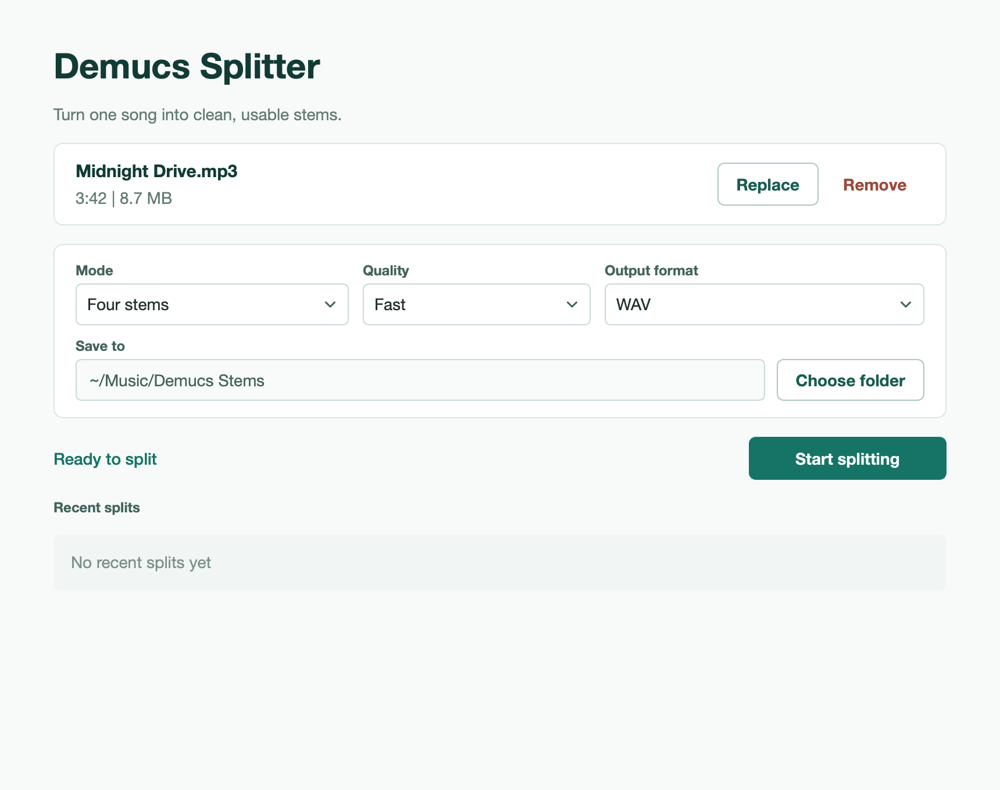
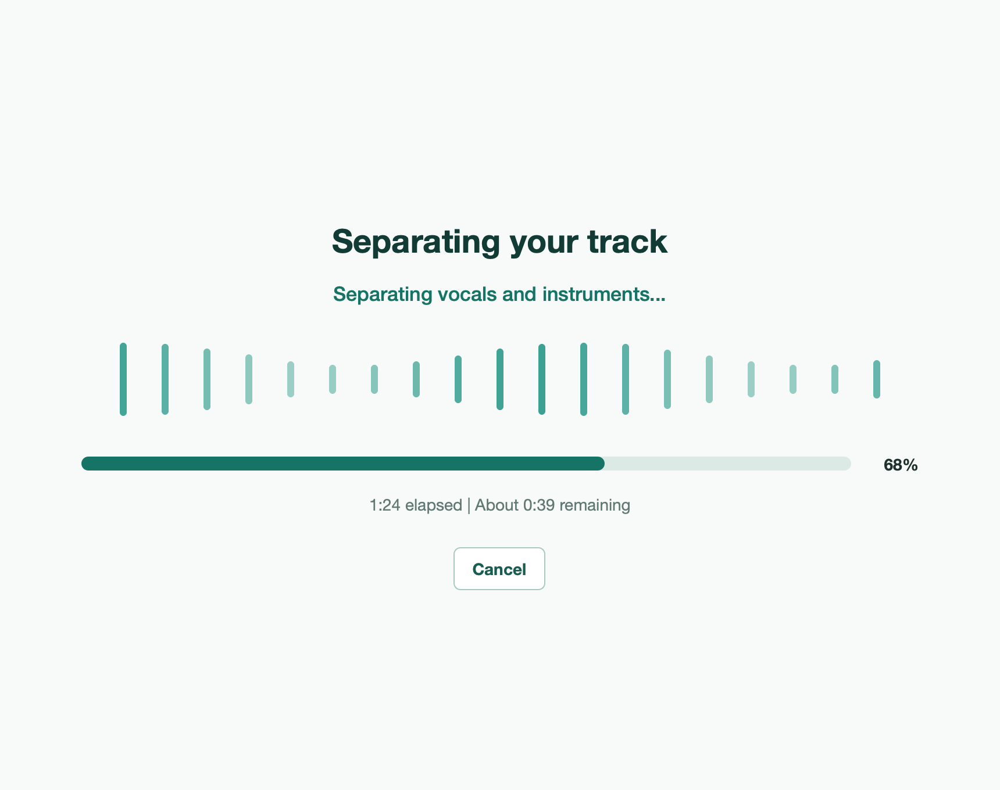

# Demucs Splitter for macOS

**A standalone macOS app for separating songs into vocals, drums, bass, and other stems with Demucs — no terminal or Python setup required.**

Demucs Splitter adds an accessible desktop interface, guided quality settings, live progress, local history, and a distributable macOS application on top of the open-source Demucs source separation engine.

[Download the latest DMG →](https://github.com/shilovpm/demucs_UI_app/releases/latest)



## What you can do

- Drag and drop an audio file into the application.
- Separate a track into **vocals, drums, bass, and other** stems.
- Create a simpler **vocals + instrumental** split.
- Choose between fast, balanced, and best-quality separation.
- Export stems as WAV, MP3, or FLAC.
- Select a custom output folder.
- Follow live progress and estimated remaining time.
- Cancel a separation without leaving incomplete output behind.
- Open completed and recent splits directly from the application.
- Process audio locally on your Mac.

## Separation options

| Setting | Available options |
| --- | --- |
| Input | MP3, WAV, FLAC, M4A, AAC, OGG |
| Mode | Four stems, Vocals + instrumental |
| Quality | Fast, Balanced, Best quality |
| Output | WAV, MP3, FLAC |
| MP3 bitrate | Configurable |

The quality profiles translate Demucs model choices into simpler product language:

- **Fast** — uses the lighter `mdx_extra_q` model.
- **Balanced** — uses `htdemucs` for a balance of speed and quality.
- **Best quality** — uses `htdemucs_ft` for more detailed results with a longer processing time.

Compatible models use Apple Metal acceleration when available, with CPU fallback where necessary.

## Install on macOS

**Compatibility:** Apple Silicon Macs with an M-series processor.

Intel-based Macs are not supported by the current build.

1. Download `Demucs-Splitter-macOS-arm64.dmg` from the [latest release](https://github.com/shilovpm/demucs_UI_app/releases/latest).
2. Open the DMG.
3. Drag **Demucs Splitter** into the **Applications** folder.
4. On the first launch, Control-click the application and choose **Open**.
5. Confirm the launch by clicking **Open** again.

The extra first-launch step is required because the current build is not signed with an Apple Developer ID or notarized.

Python, PyTorch, Demucs, FFmpeg, and the application dependencies are included in the app bundle.

An internet connection is required the first time a separation model is used so Demucs can download its model weights.

## How to use

1. Drop an audio file into the application or choose one from Finder.
2. Select the separation mode.
3. Choose a quality profile and output format.
4. Select an output folder or keep the default.
5. Click **Split track**.
6. Follow the separation progress.
7. Open the generated stems from the completion screen.

By default, completed jobs are stored in:

```text
~/Music/Demucs Stems
```

Each job receives its own timestamped output folder.



## What this fork adds

The original Demucs project provides the source separation models and Python tools. This fork adds the product layer required to make them usable as a standalone macOS application.

### Desktop workflow

- Drag-and-drop audio import
- Guided separation settings
- Clear input validation and error states
- Live progress and remaining-time estimates
- Cancellation support
- Completion screen with direct access to generated files
- Local history of recent splits

### Simplified model selection

Users choose between **Fast**, **Balanced**, and **Best quality** instead of needing to understand Demucs model names and command-line arguments.

### Safer file handling

- Checks supported audio formats before starting.
- Verifies that the output folder is writable.
- Estimates required disk space.
- Creates a dedicated folder for each job.
- Removes incomplete output after errors or cancellation.

### macOS distribution

The application is packaged as a `.app` and distributed through a DMG. The bundle includes the Python runtime, PyTorch, Demucs, FFmpeg, FFprobe, interface assets, and other required dependencies.

## How it works

```text
PySide6 interface
        |
        v
Background separation thread
        |
        +--> Demucs API
        |      |
        |      `--> PyTorch model
        |
        +--> FFmpeg / FFprobe
        |
        `--> Local WAV, MP3, or FLAC files
```

The interface runs separately from the separation process so the application remains responsive while a track is being processed.

Demucs runs locally. Audio files are not uploaded to a remote processing service. Network access is only needed to download model weights when a model is used for the first time.

## Tech stack

- **Application:** Python, PySide6
- **Separation engine:** Demucs
- **Machine learning:** PyTorch, torchaudio
- **Audio processing:** FFmpeg, FFprobe, SoundFile
- **macOS packaging:** PyInstaller, DMG
- **Acceleration:** Apple Metal Performance Shaders with CPU fallback

## Run from source

Create a Python environment and install the project dependencies:

```bash
python3 -m venv demucs_env

demucs_env/bin/python -m pip install --upgrade pip
demucs_env/bin/python -m pip install -r requirements.txt -r requirements_gui.txt
```

Start the application:

```bash
demucs_env/bin/python -m demucs_app
```

FFmpeg and FFprobe must be available on the system when running from source.

## Build the macOS app

Install FFmpeg and the required Python dependencies, then run:

```bash
sh tools/build_macos_app.sh
```

The generated application will be available at:

```text
dist/Demucs Splitter.app
```

To create the distributable DMG:

```bash
sh tools/build_macos_dmg.sh
```

The resulting file will be written to:

```text
release/Demucs-Splitter-macOS-arm64.dmg
```

The build scripts bundle the FFmpeg and FFprobe executables found in the current `PATH`.

## Development checks

Run the desktop application tests with:

```bash
demucs_env/bin/python -m unittest discover -s demucs_app/tests
```

The test suite covers output paths, audio validation, runtime dependencies, progress calculation, and interface states.

## Known limitations

- The distributed build supports Apple Silicon Macs only.
- The application processes one audio file at a time.
- The application is not currently signed or notarized.
- Model weights are downloaded separately on first use.
- Separation speed depends on track length, selected quality, and available hardware.
- Source separation is probabilistic and may produce bleeding or audio artifacts.
- The experimental six-source Demucs model is not exposed in the current interface.

## Demucs and upstream documentation

Demucs Splitter is built on top of the open-source [Demucs](https://github.com/adefossez/demucs) project created by Alexandre Défossez and its contributors.

This repository remains a fork so that the separation engine and its history stay attributable to the original project.

The complete original Demucs README, including command-line usage, model descriptions, training instructions, research results, and citations, is preserved in [UPSTREAM_README.md](UPSTREAM_README.md).

Additional upstream documentation remains available in the [`docs`](docs) directory.

## License

Demucs and this fork are distributed under the [MIT License](LICENSE).

The Demucs model architecture, training code, command-line tools, and original documentation belong to the upstream Demucs project and its contributors.
